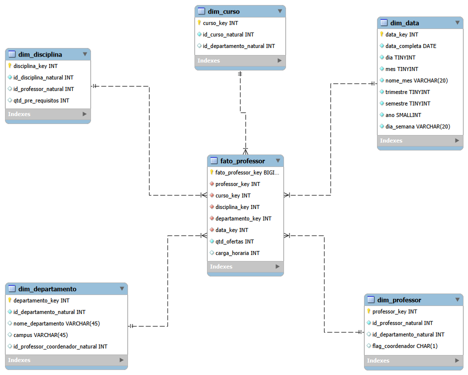

# Modelagem Dimensional - Universidade

Projeto desenvolvido como desafio prático da DIO, com foco na construção de um modelo dimensional (Star Schema) a partir de um modelo relacional de uma universidade.

## 🎯 Objetivo

Criar um esquema em estrela com foco na análise de professores, estruturando os dados em uma tabela fato e tabelas dimensão.

## 🧱 Estrutura do modelo

### Tabela Fato

* **fato_professor**

  * Métricas: quantidade de ofertas, carga horária

### Tabelas Dimensão

* **dim_professor**
* **dim_departamento**
* **dim_disciplina**
* **dim_curso**
* **dim_data**

## 📊 Diagrama Star Schema

## 🔄 Processo de modelagem

O modelo dimensional foi construído a partir do modelo relacional fornecido, realizando:

* Identificação do objeto de análise (professor)
* Definição da tabela fato
* Criação das dimensões a partir das entidades do modelo relacional
* Eliminação de tabelas de junção (N:N) para adequação ao modelo dimensional
* Ajuste da granularidade dos dados para análise

## 📌 Observações

* O modelo foi construído com foco na análise de professores, conforme proposto no desafio
* O modelo relacional original foi transformado em um modelo dimensional, reorganizando os dados para fins analíticos
* A tabela fato representa o contexto de oferta de disciplinas por professores
* As dimensões fornecem o contexto descritivo necessário para análise (professor, curso, disciplina, departamento e tempo)
* Foi criada uma dimensão de datas para permitir análises temporais

## 📁 Arquivos do projeto

* `diagrama_star_schema_universidade.png` → imagem do diagrama
* `diagrama_star_schema_universidade.mwb` → arquivo editável (MySQL Workbench)
* `modelo_relacional_referencia.png` → modelo relacional utilizado como base
